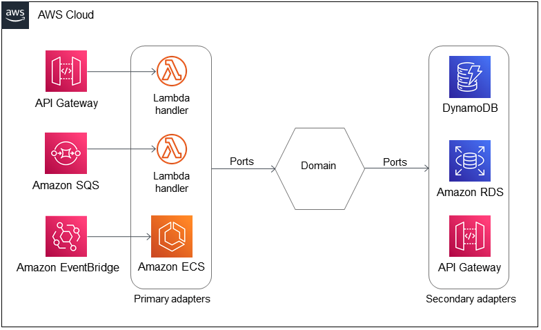
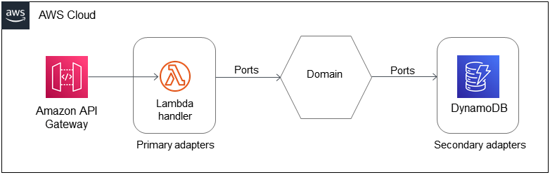

# Serverless NestJS

Plantilla con arquitectura hexagonal para desplegar una aplicación NestJS en AWS Lambda con Serverless Framework. (
NestJS v10 + Serverless v3 + AWS)

## Instalación

```bash
npm install # Instalar dependencias 
```

## Configurar archivo .env

```bash
cp .env.example .env # Copiar archivo de configuración
```

## Ejecutar aplicación

### Modo local

```bash
npm run start # Iniciar aplicación NestJS
npm run sls:local # Iniciar aplicación Serverless en modo local
npm run sls:debug # Iniciar aplicación Serverless en modo local con debug
npm run sls:remove # Eliminar aplicación Serverless en modo local
```

### Desplegar en AWS en modo desarrollo

```bash
npm run sls:deploy # Desplegar aplicación en AWS
npm run sls:remove # Eliminar aplicación en AWS
```

### Desplegar en AWS en modo producción

```bash
npm run sls:build # Desplegar aplicación en AWS
npm run sls:remove # Eliminar aplicación en AWS
```

## Arquitectura Hexagonal

```bash
my-app/ 
├── src/ 
├──── common/ # Carpeta común
├──── modules/ # Carpeta de módulos
├────── samples/ # Carpeta de muestra
├──────── samples.module.ts # Archivo de módulo de muestra
├────────── middlewares/ # Carpeta de middlewares
├────────── guards/ # Carpeta de guards
├────────── controllers/ # Carpeta de controladores
├──────────── samples.controller.ts # Archivo de controlador de muestra
├────────── dtos/ # Carpeta DTOs (Data Transfer Objects)
├──────────── sample.dto.ts # Archivo DTO de creación de muestra
├────────── serverless/ # Carpeta de configuración de serverless
├──────────── events.yaml # Archivo de eventos de serverless
├──────────── lambda.ts # Archivo de lambda handler
├────────── use-cases/ # Carpeta de casos de uso
├──────────── sample.service.ts # Archivo de caso de uso de muestra
├────────── entities/ # Carpeta de entidades
├──────────── sample.entity.ts # Archivo de entidad de muestra
├────────── ports/ # Carpeta de puertos
├──────────── input/ # Carpetas de entrada de puertos
├────────────── sample-input.usecase.ts # Archivo de entrada de caso de uso de muestra
├──────────── output/ # Carpeta de salida de puertos
├────────────── sample-interface.repository.ts # Archivo de salida de repositorio de muestra
├────────── database/ # Carpeta de base de datos
├──────────── repositories/ # Carpeta de repositorios
├────────────── sample.repository.ts # Archivo de repositorio de muestra
```

### Ejemplo #1



### Ejemplo #2



## Fuentes

https://serverlessland.com/content/service/lambda/guides/effectively-running-java-on-serverless/hexagonal